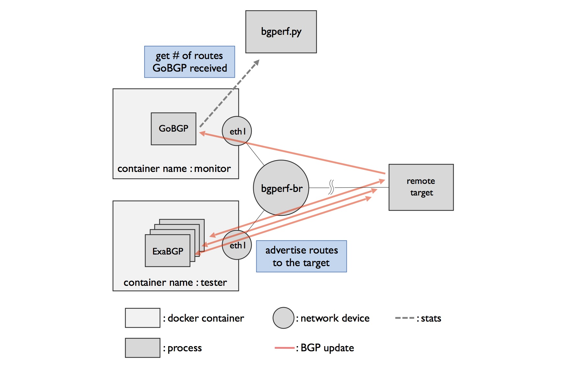

# Benchmark remote target



To benchmark remote bgp target, make bgperf configuration file manually and
add `remote: true` to the `target` configuration.

```shell
$ cat scenario.yaml
local_prefix: 192.168.10.0/24
monitor:
  as: 1001
  check-points: [20]
  local-address: 192.168.10.2
  router-id: 10.10.0.2
target: {as: 1000, local-address: 192.168.10.1, router-id: 10.10.0.1, remote: true}
testers:
- neighbors:
    10.10.0.3:
      as: 1003
      local-address: 192.168.10.3
      paths: [100.0.0.0/32, 100.0.0.1/32, 100.0.0.2/32, 100.0.0.3/32, 100.0.0.4/32,
        100.0.0.5/32, 100.0.0.6/32, 100.0.0.7/32, 100.0.0.8/32, 100.0.0.9/32]
      router-id: 10.10.0.3
    10.10.0.4:
      as: 1004
      local-address: 192.168.10.4
      paths: [100.0.0.10/32, 100.0.0.11/32, 100.0.0.12/32, 100.0.0.13/32, 100.0.0.14/32,
        100.0.0.15/32, 100.0.0.16/32, 100.0.0.17/32, 100.0.0.18/32, 100.0.0.19/32]
      router-id: 10.10.0.4
```

Use `-f` option to pass the configuration.

```shell
$ sudo ./bgperf.py bench -f scenario.yaml
```

For remote benchmarking, bgperf.py can't collect cpu/memory stats.
