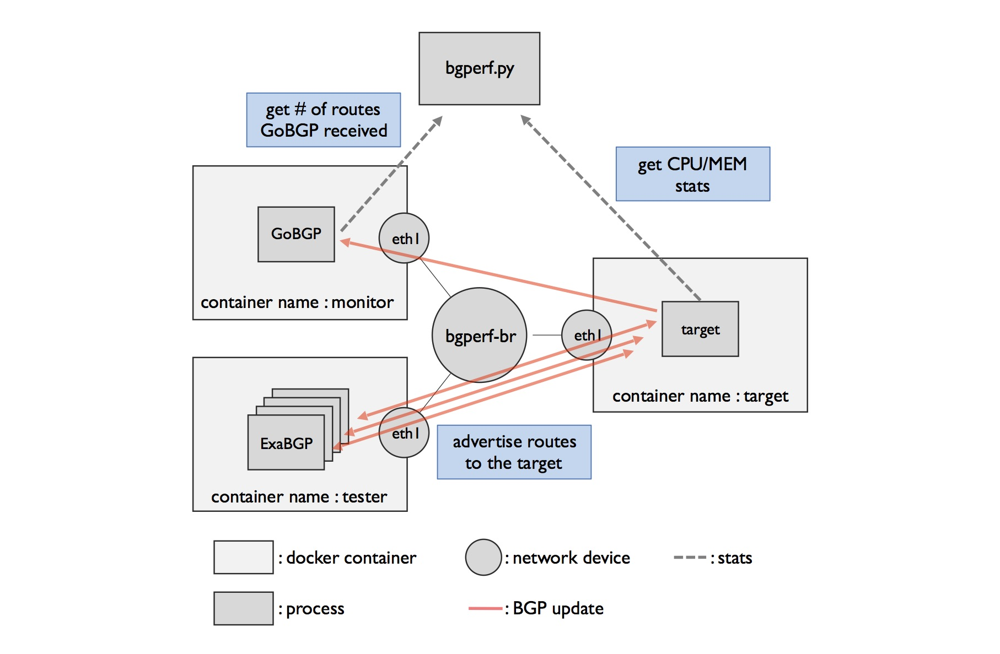

# How bgperf works



When `bench` command issued, `bgperf` boots three (or more) docker containers,
`target`, `monitor` and one or more `tester` and connect them via a bridge (`bgperf-br` by default).

By default, `bgperf` stores all configuration files and log files under `/tmp/bgperf`.
Here is what you can see after issuing `bgperf.py bench -n 10`.

```shell
$ tree /tmp/bgperf
/tmp/bgperf
├── gobgp
│   ├── gobgpd.conf
│   ├── gobgpd.log
│   └── start.sh
├── monitor
│   ├── gobgpd.conf
│   ├── gobgpd.log
│   └── start.sh
├── scenario.yaml
└── tester
    ├── 10.10.0.10.conf
    ├── 10.10.0.10.log
    ├── 10.10.0.11.conf
    ├── 10.10.0.11.log
    ├── 10.10.0.12.conf
    ├── 10.10.0.12.log
    ├── 10.10.0.3.conf
    ├── 10.10.0.3.log
    ├── 10.10.0.4.conf
    ├── 10.10.0.4.log
    ├── 10.10.0.5.conf
    ├── 10.10.0.5.log
    ├── 10.10.0.6.conf
    ├── 10.10.0.6.log
    ├── 10.10.0.7.conf
    ├── 10.10.0.7.log
    ├── 10.10.0.8.conf
    ├── 10.10.0.8.log
    ├── 10.10.0.9.conf
    ├── 10.10.0.9.log
    └── start.sh

3 directories, 28 files
```

`scenario.yaml` controls all the configuration of benchmark. You can pass your own scenario by using `-f` option.
By default, `bgperf` creates it automatically and places it under `/tmp/bgperf` like above. Let's see what's inside `scenario.yaml`.

```shell
$ cat /tmp/bgperf/scenario.yaml
<%
    import netaddr
    from itertools import islice

    it = netaddr.iter_iprange('100.0.0.0','160.0.0.0')

    def gen_paths(num):
        return list('{0}/32'.format(ip) for ip in islice(it, num))
%>
local_prefix: 10.10.0.0/24
monitor:
  as: 1001
  check-points: [1000]
  local-address: 10.10.0.2
  router-id: 10.10.0.2
target: {as: 1000, local-address: 10.10.0.1, router-id: 10.10.0.1}
testers:
- name: tester
  neighbors:
    10.10.0.10:
      as: 1010
      filter:
        in: &id001 []
      local-address: 10.10.0.10
      paths: ${gen_paths(100)}
      router-id: 10.10.0.10
    10.10.0.100:
      as: 1100
      filter:
        in: *id001
      local-address: 10.10.0.100
      paths: ${gen_paths(100)}
      router-id: 10.10.0.100
    10.10.0.101:
      as: 1101
      filter:
        in: *id001
      local-address: 10.10.0.101
      paths: ${gen_paths(100)}
      router-id: 10.10.0.101
...(snip)...
```

It describes local address, AS number and router-id of each cast.
With regard to tester, it also describes the routes to advertise to the target.

`check-points` field of `monitor` control when to end the benchmark.
During the benchmark, `bgperf.py` continuously checks how many routes `monitor` have got.
Benchmark ends when the number of received routes gets equal to check-point value.

As you may notice, `scenario.yaml` is [mako](http://www.makotemplates.org/) templated. You can use mako templating to simplify
your scenario.
